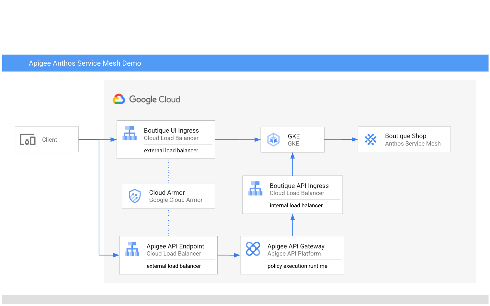

# API Management + Microservices Demo

This demo extends the existing GCP Boutique Shop [Microservices demo](https://github.com/GoogleCloudPlatform/microservices-demo) to show
how to use Apigee for exposing internal gRPC services (inside the mesh) as RESTful API to external consumers (outside the mesh).

When exposing APIs to external consumers, there are key challenges that arise due to the nature of external consumption.
Here are a few of them from the point of view of both the API producer, and the API consumer.

### API Producer challenges
* How do you expose a cohesive and consistent RESTful API surface (from disparate underlying services)?
  * Consistent & RESTful URL paths
  * Consistent & RESTful HTTP status codes
  * Consistent & RESTful error message formats
  * Consistent & RESTful request & response payloads
  * Consistent & RESTful authentication mechanisms
* How do you measure engagement and get key usage / business insights for the APIs being exposed?
* How do you monetize the APIs being exposed?

### API Consumer challenges
* How do you discover APIs available?
* How do you learn to use the APIs available?
* How do you sign-up (get credentials) to use the APIs available?

While this demo does not address every single use-case listed above, it does show the core components and concepts needed to use Apigee in this context.

## Demo Architecture

The demo assumes you are deploying all components in GCP, and that you are using Apigee X in combination with GKE + Anthos Service Mesh.

<p align="center">

</p>


## Prerequisites
1. Provision Apigee X
2. Enable external API traffic to your Apigee X instance
3. Make sure the following tools are available in your terminal $PATH
    * [gcloud SDK](https://cloud.google.com/sdk/docs/0install)
    * kubectl
    * wget
    * unzip
    * curl
    * jq

## (QuickStart) Demo CloudShell setup tutorial

Use the following GCP CloudShell tutorial, and follow the instructions.

[](https://ssh.cloud.google.com/cloudshell/open?cloudshell_git_repo=https://github.com/ssvaidyanathan/apigee-asm-demo&cloudshell_git_branch=main&cloudshell_workspace=.&cloudshell_tutorial=docs/cloudshell-tutorial.md)


## Demo instructions

1. Clone this repo, and switch the main directory

```
git clone https://github.com/ssvaidyanathan/apigee-asm-demo.git
cd apigee-asm-demo
```

2. Edit the `env.sh` and set ENV vars, then source it

```
source ./env.sh
```

3. Run script to create a GKE cluster
```bash
./create-gke-cluster.sh 
```

4. Run script to deploy ASM and the Online Boutique Shop demo

```bash
./deploy-asm.sh 
```

5. Run scrip to create a private API ingress (for Apigee to hit) & gRPC transcoding service

```bash
./deploy-gateway.sh 
```


6. Deploy Apigee API proxies, target server, products, apps
```bash
./deploy-apigee.sh 
```

## Testing the Apigee RESTful API proxies

The script that deploys the Apigee API proxies prints a few sample cURL commands that you can use to test.

Those sample cURL commands already have the necessary API key for each of the API calls.

```bash
curl https://{APIGEE_HOST}/productservice/products?apikey=API_KEY_FROM_APIGEE_DEVELOPER_APP
curl https://{APIGEE_HOST}/currencyservice/currencies?apikey=API_KEY_FROM_APIGEE_DEVELOPER_APP
```

## Troubleshooting

1. Apigee is not able to reach the API private ingress

   You can use a GCE VM within the same VPC Network and try using cURL to test for connectivity.

   First, get the IP address of the API ingress load balancer

   ```bash
   export ILB_IP=$(kubectl get services api-ingressgateway -n $API_GATEWAY_NAMESPACE -o jsonpath='{.status.loadBalancer.ingress[0].ip}')
   echo "ILB_IP=${ILB_IP}"
   ```

   Then, from within the GCE VM, run the following curl command to get product catalog data

   ```bash
   curl http://$ILB_IP/products 
   ```

   If this works, but Apigee is still not able to reach this endpoint, verify that the Apigee Target Server has the right IP address.


## Cleanup

For each fo the "deploy" scripts, there is an equivalent "cleanup" script you can run.
If you want to clean the entire setup, first source your `env.sh` script, and then run the scripts in the following order

```bash
./cleanup-apigee.sh
./cleanup-gateway.sh
./cleanup-asm.sh
```

Then, finally you can remove the GKE cluster with

```bash
./delete-gke-cluster.sh
```

## Not Google Product Clause

This is not an officially supported Google product, nor is it part of an
official Google product.

## Support

If you need support or assistance using the tool, you can try inquiring on [Google Cloud Community
forum dedicated to Apigee](https://www.googlecloudcommunity.com/gc/Apigee/bd-p/cloud-apigee).  There is no service-level guarantee for
responses to inquiries regarding this tool.

## License

This material is [Copyright 2022 Google LLC](./NOTICE)
and is licensed under the [Apache 2.0 License](LICENSE).
